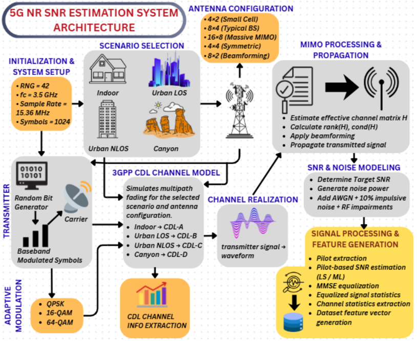

<h1 align="center">5G NR CDL-SNR Dataset</h1>

  A 100,000-sample synthetic dataset for SNR estimation in 5G NR channels, generated across four 3GPP TR 38.901 CDL propagation profiles with six stochastic RF impairments, MIMO beamforming, and classical pilot-based SNR estimator baselines.

<em>Companion dataset for the paper "Lightweight Domain-Adaptive SNR Estimation for 5G NR Channels via Scenario-Embedded Transfer Learning."</em>

<h2>Overview</h2>

This repository provides a standards-compliant, fully-labeled dataset for benchmarking SNR estimation techniques under realistic 5G NR channel conditions:

<ul>
  <li><strong>3GPP CDL Channel Realizations:</strong> Four propagation profiles (CDL-A/B/C/D) spanning indoor office, urban LOS, urban NLOS, and canyon environments.</li>
  <li><strong>MIMO & Beamforming:</strong> Five antenna configurations (small cell, typical BS, massive MIMO, symmetric, beamforming-optimized) with random steering and effective channel estimation.</li>
  <li><strong>RF Impairment Models:</strong> Doppler, PA nonlinearity, IQ imbalance, phase noise, colored noise, and co-channel interference, each injected stochastically at realistic deployment rates.</li>
  <li><strong>Classical SNR Estimator Baselines:</strong> LS, ML, EVM, M2M4, Rao, and decision-directed (DD) estimators computed per sample as reference labels.</li>
  <li><strong>Environment Setup:</strong> MATLAB generator script to regenerate or extend the dataset from scratch.</li>
</ul>

<h2>System Architecture</h2>

  

<em>Fig. 1 : End-to-end dataset generation pipeline: scenario selection, 3GPP CDL channel realization, MIMO propagation, RF impairment injection, and feature-based SNR estimation.</em>

<table>
  <tr><th>Stage</th><th>Description</th></tr>
  <tr><td>Initialization &amp; System Setup</td><td>RNG seed = 42, fc = 3.5 GHz, sample rate = 15.36 MHz, 1024 symbols/frame</td></tr>
  <tr><td>Scenario Selection</td><td>4 environments — Indoor, Urban LOS, Urban NLOS, Canyon</td></tr>
  <tr><td>3GPP CDL Channel Model</td><td>Indoor → CDL-A, Urban LOS → CDL-B, Urban NLOS → CDL-C, Canyon → CDL-D</td></tr>
  <tr><td>Antenna Configuration</td><td>5 MIMO configs: 4×2, 8×4, 16×8, 4×4, 8×2</td></tr>
  <tr><td>Channel Realization</td><td>Simulates multipath fading for the selected scenario and antenna configuration</td></tr>
  <tr><td>MIMO Processing &amp; Propagation</td><td>Effective channel matrix H, rank(H)/cond(H), beamforming, signal propagation</td></tr>
  <tr><td>Adaptive Modulation</td><td>QPSK / 16-QAM / 64-QAM, selected by target SNR</td></tr>
  <tr><td>SNR &amp; Noise Modeling</td><td>Target SNR, noise power, AWGN + 10% impulsive noise + RF impairments</td></tr>
  <tr><td>Signal Processing &amp; Feature Generation</td><td>Pilot extraction, LS/ML SNR estimation, MMSE equalization, feature vector generation</td></tr>
</table>

<h2>Dataset Composition</h2>
<table>
  <tr><th>Profile</th><th>Delay Spread (ns)</th><th>SNR Range (dB)</th><th>Rician K-factor (dB)</th><th>Samples</th></tr>
  <tr><td>CDL-A (Indoor Office)</td><td>10–50</td><td>0 to 25</td><td>5–15</td><td>25,000</td></tr>
  <tr><td>CDL-B (Outdoor Urban LOS)</td><td>50–150</td><td>−5 to 20</td><td>3–10</td><td>20,000</td></tr>
  <tr><td>CDL-C (Outdoor Urban NLOS)</td><td>100–300</td><td>−10 to 15</td><td>0–3</td><td>35,000</td></tr>
  <tr><td>CDL-D (Outdoor Canyon)</td><td>200–400</td><td>−15 to 10</td><td>0–2</td><td>20,000</td></tr>
</table>

<strong>Total: 100,000 samples</strong> across 4 CDL profiles × 5 antenna configurations × 3 modulation schemes.

<h2>RF Impairment Models</h2>
<table>
  <tr><th>Impairment</th><th>Model</th><th>Injection Rate</th></tr>
  <tr><td>Doppler</td><td>h(t) = heff·ej2πfDt, fD = v·fc/c</td><td>100%</td></tr>
  <tr><td>PA Nonlinearity</td><td>xPA = x / (1 + α|x|²), α ~ U(0.05, 0.20)</td><td>60%</td></tr>
  <tr><td>IQ Imbalance</td><td>xIQ = αIQx + βIQx*, gain ∈ [0.3, 1.5] dB, phase ∈ [1°, 5°]</td><td>50%</td></tr>
  <tr><td>Phase Noise</td><td>Wiener process random walk, −80 dBc/Hz</td><td>80%</td></tr>
  <tr><td>Colored Noise</td><td>n[k] = ρ·n[k−1] + √(1−ρ²)·w[k], ρ ~ U(0.3, 0.8)</td><td>40%</td></tr>
  <tr><td>Co-Channel Interference</td><td>BPSK interferer, SIR ~ U(5, 20) dB</td><td>30%</td></tr>
</table>

An additional impulsive noise component is injected with 10% probability, affecting ~2% of symbols when present.

<blockquote>
  <strong>Note:</strong> Carrier Frequency Offset (CFO) is intentionally excluded — at a normalized offset of ε = 0.01–0.05 it dominates all estimators (ΔRMSE ≈ +30 dB), preventing meaningful baseline comparison. CFO compensation (e.g., Moose/Schmidl-Cox) is assumed at the receiver.
</blockquote>

<h2>Classical SNR Estimator Baselines</h2>
<table>
  <tr><th>Estimator</th><th>Basis</th></tr>
  <tr><td>LS-SNR</td><td>Least-squares pilot channel estimate</td></tr>
  <tr><td>ML-SNR</td><td>Maximum-likelihood pilot channel estimate</td></tr>
  <tr><td>EVM-SNR</td><td>Error Vector Magnitude after MMSE equalization</td></tr>
  <tr><td>M2M4-SNR</td><td>Second/fourth-moment (M2M4) blind estimator</td></tr>
  <tr><td>Rao-SNR</td><td>Energy-based (Rao) blind estimator</td></tr>
  <tr><td>DD-SNR</td><td>Decision-directed estimator</td></tr>
</table>

<h2>Feature Vector (22 features/sample)</h2>
<table>
  <tr><th>#</th><th>Feature</th><th>#</th><th>Feature</th></tr>
  <tr><td>1</td><td>Channel gain</td><td>12</td><td>Equalized signal power</td></tr>
  <tr><td>2</td><td>Channel condition number</td><td>13</td><td>Equalized signal std</td></tr>
  <tr><td>3</td><td>Channel rank</td><td>14</td><td>Kurtosis</td></tr>
  <tr><td>4</td><td>RMS delay spread (ns)</td><td>15</td><td>Num. Tx antennas</td></tr>
  <tr><td>5</td><td>Coherence bandwidth (MHz)</td><td>16</td><td>Num. Rx antennas</td></tr>
  <tr><td>6</td><td>K-factor (dB)</td><td>17</td><td>Flag: PA nonlinearity active</td></tr>
  <tr><td>7</td><td>Number of paths</td><td>18</td><td>Flag: IQ imbalance active</td></tr>
  <tr><td>8</td><td>Max delay (ns)</td><td>19</td><td>Doppler shift (Hz)</td></tr>
  <tr><td>9</td><td>Rx power</td><td>20</td><td>Flag: phase noise active</td></tr>
  <tr><td>10</td><td>Rx power std</td><td>21</td><td>Flag: colored noise active</td></tr>
  <tr><td>11</td><td>Rx phase mean</td><td>22</td><td>Flag: co-channel interference active</td></tr>
</table>

Target label: <code>SNR_dB</code> (ground-truth SNR in dB).

<h2>Getting Started</h2>

<h3>Installation</h3>

Clone the repository:

<pre><code>git clone https://github.com/Swandip7/5GNR-SNR-Impairments-Dataset.git
cd 5GNR-SNR-Impairments-Dataset
</code></pre>

<strong>Requirements:</strong>

<ul>
  <li>MATLAB R2024a (or later)</li>
  <li>5G Toolbox</li>
  <li>Communications Toolbox</li>
  <li>Signal Processing Toolbox</li>
  <li>Statistics and Machine Learning Toolbox</li>
</ul>

The dataset generation code relies on MATLAB's <code>nrCDLChannel</code> implementation from the 5G Toolbox together with modulation, channel modeling, and signal processing functions provided by the listed toolboxes.

<h2>Repository Structure</h2>
<ul>
  <li><code>assets/pipeline_architecture.png</code> — Fig. 1, dataset generation pipeline diagram</li>
  <li><code>data/Enhanced_5G_Dataset_100K.csv</code> — 100K samples, 22 features + SNR_dB label</li>
  <li><code>generate_dataset.m</code> — MATLAB dataset generator</li>
  <li><code>requirements.txt</code> — Python package dependencies for downstream analysis</li>
</ul>

<h2>Citation</h2>

If you use this dataset, please cite the accompanying paper after publication. Citation information will be updated here once the manuscript is accepted.

<h2>Contributing</h2>

We welcome contributions! If you want to extend the dataset, add new impairment models, fix bugs, or improve documentation, please open an issue or submit a pull request.

<h2>Acknowledgements</h2>

This dataset was developed to support reproducible research on domain-adaptive SNR estimation for 5G NR communication systems under realistic propagation and RF impairment conditions.

<h2>License</h2>

This project is distributed under the MIT License.
See the <code>LICENSE</code> file for details.

